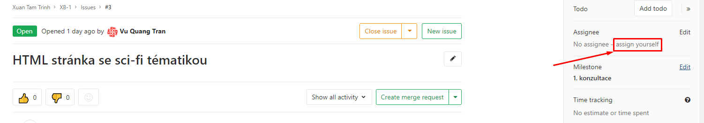
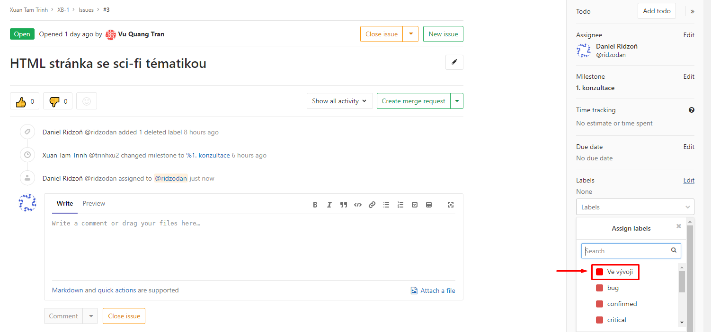
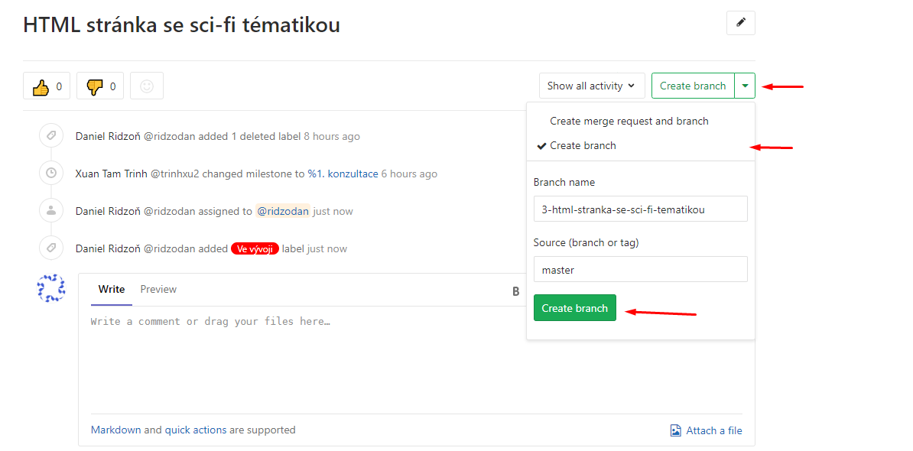

Zapnutí projektu
================

Instalace
---------
Pro prvni zapnuti serveru zadejte: `sudo sh install.sh`

Spusteni serveru
----------------
Pokud jste jiz provedli prvni instalaci, server spustite takto: `sh run.sh`

Zapnuti na linux subsystemu pro windows
---------------------------------------
Nemuzu zarucit ze to bude na 100% fungovat

instalace: `sudo -H ./windows_install.sh`

spusteni: `./windows_run.sh`

zaponuti virtualenv
-------------------
`source xb1_env/bin/activate`

vypnuti virtualenv
------------------
`deactivate`

vytvoreni superusera
--------------------
`python3 manage.py createsuperuser`

prvni spusteni - OBLIGATORY
---------------------------
* prejdete do home directory projektu (pro spusteni initial webu prejdete do slozky InitialWeb)
* vytvorte novy virtual enviroment (`virtualenv xb1_env`)
* zapnete virtual enviroment (`source xb1_env/bin/activate`)
* stahnete potrebne zavislosti (`pip install -r requirements.txt`)
* prejdete do slozky, ve ktere je django projekt (`cd xb1`)
* zapnete django server (`python manage.py runserver`)
* pote co ho vypnete, spuste (`python manage.py migrate`), aplikuji se zmeny v aplikaci do databaze

spusteni - OBLIGATORY
---------------------
* prejdete do home directory projektu
* zapnete virtual enviroment (`source xb1_env/bin/activate`)
* prejdete do slozky, ve ktere je django projekt (`cd xb1`)
* zapnete django server (`python manage.py runserver`)

Code of conduct
===============

Výběr tasku
-----------
V záložce [Issues](https://gitlab.fit.cvut.cz/trinhxu2/xb-1/issues) vyberte otevřený úkol, který **nemá label** "Ve vývoji".

Následně se přiřaďte pod tento task, kliknutím na **assign yourself**.

Tasku přidejte label **Ve vývoji** (Lépe je pak vidět, že task je obsazený).

Vytvořte si pro task novou větev na Gitlabu. **Nepracujte ve větvi master!**
Klikněte na **Create merge request**.
Zvolte že chcete jen branch.
Jméno nové branche neměnte, source branch ponechte master. 

Commitování změn
----------------
V commit message popište stručně, anglicky co jste ve změně udělali.

Odevzdání tasku
---------------
Pokud jste již úkol dodělali, udělejte do něj merge master větve.
Následně vytvořte nový merge request na větev master a za assignee dejte jméno **@ridzodan**.
Pokud je v titlu commit message, přepiště title na název úkolu/branche.
Do komentáře zapište, kolik času jste na úkolu strávili. (např.: `/spend 2h 10m`)
Klikněte na **submit merge request**.