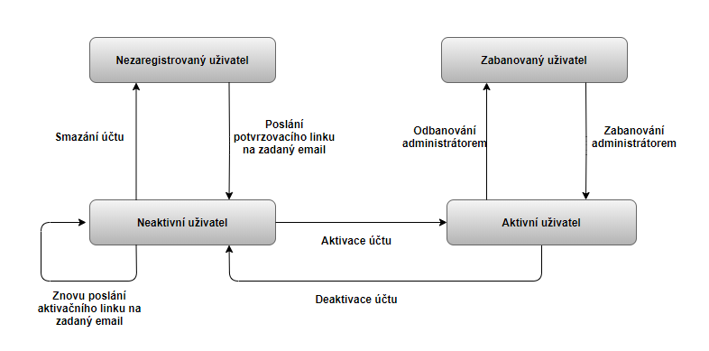
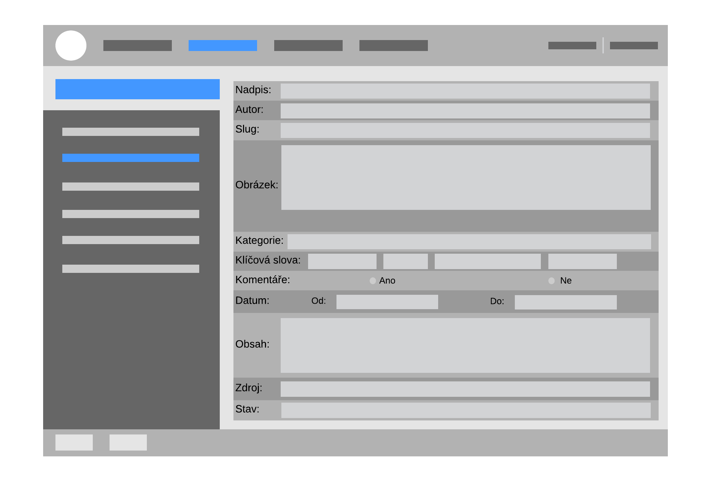
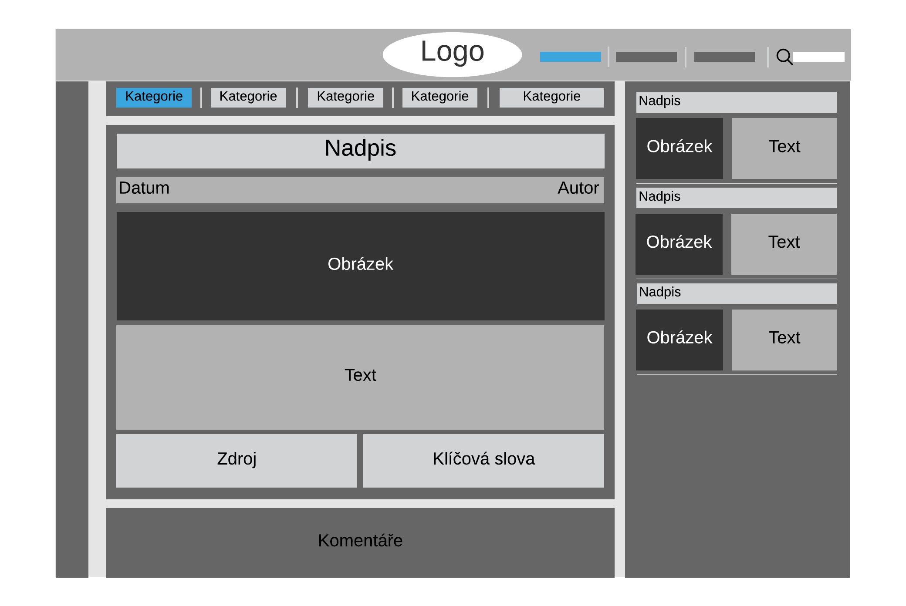

Projekt XB-1
=============

Úvod
----

Tento dokument je první iterací a současně povinnou částí projektu XB-1

Osnova
------

1. Základní popis projektu
2. Popis práce a její rozdělení členům týmu
3. Analýza autorských práv původní webové aplikace
4. Analýza konkurenčních stránek
5. Funkční požadavky
6. Nefunkční požadavky

Obsah
-----

1. Základní popis projektu

    Cílem projektu týmu Ikarie je vytvoření nové plně funkční webové aplikace, která bude sdružovat komunitu Sci-Fi časobisu XB-1.
    Projekt by měl nahradit v současnosti již nefunkční systém. Základním požadavkem projektu je především správná a bezpečná funkčnost základních funkcí potřebných pro správu a využívání fanouškovské webové aplikace, přesný výpis požadovaných funcionalit lze nalézt v sekci 5.1 Funkční požadavky.
    Design webové části nové aplikace by měl být inspirován starým vzhledem včetně znovu použití loga, které bylo dodáno zadavatelem projektu.
    Jelikož nebyly dodány žádné nároky na jazykové provedení, bude projekt vyvíjen v jazyku Python za pomoci frameworku Django. Konkrétní jazyk a framework byly vybrány po analýze současného trhu s webovými aplikacemi, kde je v současné době nejpoužívanějším frameworkem právě Django a to především kvůli své spolehlivosti, jednoduchosti a bezpečnosti, protože mnoho bezpečnostích mechanismů je již implementováno.

2. Popis práce a její rozdělení členům týmu

    Práce na webových projektech lze obecně rozdělit do několika samostatných částí vývoj frontendu, vývoj backendu, testování. Zároveň lze práci rozdělit na jednotlivé úkoly, které vyplývají ze specifického zadání projektu, např. vývoj systému pro uživatele, vývoj redakčního systému pro administrátora, správa eshopu, objednávek a platba.

    Členové týmu včetně rozdělení práce:  
    Daniel Ridzoň **(ridzodan)** - *Vedoucí týmu, správa git a merge requestů*  
    Tomáš Kovářík **(kovart12)** - *Rozhraní eshop, testování*  
    David Trinch **(trinhxu2)** -  
    Adam Tran **(tranvuqu)** -  
    Petr Šmejkal **(smejkp13)** - *frontend vývojář, testování*

3. Analýza autorských práv původní webové aplikace

    Součástí projektu je i analýza všech práv vztahujících se na současnou nefunkční verzi webové aplikace dodanou externí firmou zadavateli.
    V současné době podle slov zadavatele se na serveru nachází pouze zlomek původních zdrojových kodů (jazyk neuveden), a protože nový projekt bude vyvíjen bez přístupu k původních zbývajícím zdrojovým kodům bude tedy zajištěna ochrana před možným proviněním proti autorskému zákonu.
    Zároveň s tím musí být zajištěna dostatečná originalita nového vzhledu webové aplikace, aby nebyla porušena autorská práva.
    Ze slov zadavatele vyplývá, že je autorem/má povolení použít již dodané logo původní aplikace avšak nemá právo použít původní design a pozadí.
    Autorský zákon chránící díla včetně webového design, který je jako originální uspořádání a upravení již implementovaných komponent také předmětem autorského zákona.
    Zároveň však zmiňuje že design webových stránek, který je často z mnoha různých důvodů podřizován velkému množství konvencí, včetně používání veřejně dostupných frameworků, může vykazovat určité rysové podobnosti s dílem jiného autora, protože tato podobnost neplyne z tvořivé činnosti autorů, ale ze základních prvků používaného framworku.

4. Analýza konkurenčních stránek

    Co jsou naše konkurenční stránky:
    - fan page časopisů
    - oficiální stránky časopisů

    Co obsahují konkurenční weby:
    - články na téma daného časopisu
    - občas i ukázku článku z tištěné verze
    - diskuze pod články
    - prodej předplatného a dalších předmětů, vztahující se k časopisu
    - soutěže
    - uživatelská sekce (fanart sekce, diskuze na volné téma)

5. Funkční požadavky

    Web je spravován správci (uživateli administrátory). Dále existují běžní uživatelé, kteří mohou využít níže popsaných funkcí. Hlavním obsahem webu jsou články, ke kterým se vážou různé funkcionality v závislosti na typu uživatele.
    Dále je možné využít live chat nebo podpořit provozovatele zakoupením zboží v e-shopu.

   Uživatelská sekce:
    - uživatelé se mohou nacházet ve dvou stavech:
        - aktivní = možnost přihlášení, práva běžného uživatele/administrátora
        - neaktivní = nemožnost se přihlásit a zamezení práv běžného uživatele/administrátora, při pokusu o přihlášení mu bude sděleno, že je uživatel neaktivní, a nabídne mu znovu zaslání potvrzovacího emailu, či změny emailu
        - zabanovaný = nemožnost se přihlásit a zamezení práv běžného uživatele/administrátora + nemožnost použít aktivační link (zabanování během registrace, např. překročení limitu odeslaných žádostí,... ), při pokusu o přihlášení mu bude sděleno, že je uživatel zabanovaný (důvod banu, délka banu)  
        
    - na každé stránce se nachází vysouvací sidebar na levé straně, který nabízí různé funkcionality pro registrované uživatele (kontakt, zobrazení profilu, logout)
    - registrace uživatelů:
        - k registraci je nutné zadat přezdívku, e-mail a zvolit si heslo (včetně potvrzení)
        - poté se uživateli pošle zpráva s aktivačním linkem (validní pouze 24 hodin od odeslání) na zadaný email
        - uživatel je v tuto chvíli označen jako neaktivní a nebude mu dovoleno se přihlásit bez potvrzení (v případě, že by se pokusil přihlásit s účtem v neaktivním stavu, bude mu oznámeno, že účet je neaktivní a bude mu nabídnuta možnost zadat email znova nebo znovu zaslání zprávy s aktivačním linkem)
        - po rozkliknutí validního linku bude uživatel ve aktivním stavu a budou mu zpřístupněny uživatelské funkcionality.
    - sekce profil uživatele bude obsahovat:
        - vyplnění bližších kontaktních údajů (trvalé bydliště, jméno, příjmení) pro automatické vyplnění při objednávání z e-shopu, popřípadě změna těchto údajů
        - změna hesla
        - změna emailu (stejný způsob potvrzování jako při registraci)
        - změna hesla a emailu bude notifikována na email uživatele (při změně emailu bude zaslána notifikace  na email před změnou)
        - deaktivace účtu
    - práva běžného registrovaného uživatele:
        - přidávání/smazání/editace vlastních komentářů k článkům
        - přístup k profilové sekci, ve které může editovat svůj profil
        - kontakt s administrátory
        - možnost se zapojit k diskuzím
    - práva administrátorů:
        - správa uživatelů (zabanování/odbanování uživatele, resetování hesla pro daného uživatele, přidání práv administrátora danému účtu, změna přezdívky libovolného uživatele)
        - zabanování znamená, převod uživatele do neaktivního stavu
        - odbanování znamená, převod uživatele z neaktivního stavu do aktivního stavu
        - přidávání/smazání/editace vlastních komentářů k článkům
        - přístup k profilové sekci, ve které může editovat svůj profil
        - možnost se zapojit k diskuzím a jejich moderaci
        - možnost smazání komentářů k diskuzi/článku, které nejsou v souladu s podmínkami viz. sekce komentář
        - možnost přidání/editace/smazání vlastních článků  

   Články:
   - Za článek považujeme soubor následujících atributů:
        - Nadpis
        - Autor
        - Slug - identifikátor článku, který bude součástí URL
        - Thumbnail - obrázek, který se má zobrazit při náhledu
        - Kategorie - pomocí kategorií lze filtrovat články
        - Klíčová slova - slova, na základě kterých je možné článek vyhledat
        - Povolení komentářů
        - Datum - doba, kdy bude článek zobrazitelný - po uplynutí této doby se stav článku změní na skrytý
        - Obsah článku - obsahem článku může být text, obrázky či videa
        - Zdroje
        - Stav článku - viz. Stavy článků

   - Správa článků:
        - Práva k přidávání, editaci a mazání článku mají pouze administrátoři
        - Správa těchto článků bude realizována pomocí vybraného redakčního systému

   

   - Stavy článků:
        - Skrytý  = článek není přístupný z hlavní stránky, označuje rozpracovaný článek nebo článek, kterému skončila doba platnosti
        - Publikovaný = článek je viditelný na hlavní stránce
   - Zobrazení článků:
        - Články se nachází na hlavní stránce
        - Uprostřed se nachází uživatelem zvolený článek
        - Nevybral-li uživatel žádný článek, zobrazí se ten nejnovější
        - Pokud byly u vybraného článku povoleny komentáře, pak se pod ním zobrazí  komentáře uživatelů
        - Napravo od hlavního článku je seznam náhledů dalších článků
        - Tento seznam bude seřazený podle data publikace
        - Po rozkliknutí náhledu se v prostoru hlavního článku načte zvolený článek
   - Kategorie:
        - Nabídka kategorií se nachází nad hlavním článkem
        - Defaultně se uživateli zobrazují všechny články, dokud si nezvolí kategorii
        - Po zvolení kategorie se v seznamu náhledů zobrazí pouze články, které jsou označené příslušnou kategorií

  

   komentáře:
   - úvodní stránka zobrazuje aktuální (nejnovější) články
   - v sekci na pravé straně stránky je možné vybírat ze seznamu článků

   - funkcionality pro administrátora
        - vyvoření článku
        - smazání článku
        - úprava článku
        - přidání komentáře
        - smazání komentáře

   - funkcionality pro běžného uživatele
        - zobrazování článků
        - přidání komentáře

   - funkcionality pro neregistrované uživatele
        - zobrazování článků

    Komentáře a fórum:
    - TODO formátování?, budou správci fóra? (!= administrátor)
    - Autorizovaní uživatelé budou moci přidávat vlastní obsah na stránku jednak jako komentáře pod články a také jako komentáře v uživatelském fóru.
    - Komentáře pod články:
        - Pod koncem článku bude sekce komentářů, ve které budou autorizovaní uživatelé moci diskutovat na téma článku.
        - Každý n-tý komentář se uživateli zobrazí Captcha, aby se zabránilo spam botům.
        - Uživatel bude moci reagovat na jakýkoli z komentářů.
        - Reakce na komentáře budou vizuálně odsazené doprava (Bude stanovena maximální hloubka odsazení) pro zlepšení vizuálního kontextu diskuze.
        - Autorizovaní uživatelé budou moci hodnotit komentáře pomocí up/down 

        - jaké části má komentář:
            - hlavička komentáře:
                - ikona uživatele
                - přezdívka uživatele
                - datum a čas komentáře
                - hodnocení komentáře
            - tělo komentáře:
                - pokud se jedná o reakci, bude před komentářem zobrazen nick uživatele, na kterého reaguje (@nick)
                - samotný text komentáře
                - text komentáře bude moci být formátován (jen omezeně TODO fotky?)
            - zápatí komentáře
                - odkaz na reakci na komentář ("Odpovědět")
                - tlačítka up/down pro ohodnocení komentáře
                - tlačítko na cenzuru komentáře (jen pokud je přihlášen administrátor)

        - možnosti administrátora:
            - nastavit, zda bude možné k článku přidávat komentáře
            - možnost cenzury nevhodného komentáře (Komentář zůstane na místě, jen mu změněn původní text na informaci o nevhodném komentáři)
            - pokud uživatel bude opakovaně porušovat podmínky vkládání komentářů, může být administrátorem zablokován jeho účet
            - přidat vlastní komentář
            - možnost ukončení diskuze (od této chvíle nepůjde do diskuze přidat nový komentář)

        - možnosti autorizovaného uživatele:
            - přidat nový komentář
            - reagovat komentářem na jiný komentář
            - ohodnotit komentář

    - Uživatelské fórum
        - Uživatelské fórum bude stejná komponenta jako komentáře
        - Sekce bude vypadat a fungovat téměř stejně jako komentáře pod články
        - rozdíly oproti komentářům pod články:
            - místo článku, co udává téma, bude jen úvodní nadpis
        - jednotlivé diskuze ve fóru budou kategorizované do různých sekcí (Volná diskuze, Fanart, ...)

        - design:
            - Úvodní stránka fóra bude zobrazovat náhledy jednotlivých sekcí (Bude se jednat jen o titulky a počet příspěvků)
                - nahoře bude 5 fór, co byly v nedávné době aktivní
                - následovat budou přehledy jednotlivých sekcí (také jen 5 posledních dle aktivity)
            - Kliknutím na nadpis sekce, bude uživatel přesměrován přímo do sekce, kde již budou všechna fóra sekce seřazená dle poslední aktivity.
            - Sekce bude podporovat stránkování, pro zabránění dlouhých seznamů
            - Kliknutím na nadpis fóra bude uživatel přesměrován na jeho stránku, kde si bude moci přečíst jednotlivé komentáře a reagovat na ně.

        - tvorba nové sekce:
            - sekci může vytvořit jen administrátor
            - u sekce může nastavit, zda tvorba fóra v sekci bude povolena pro všechny autorizované uživatele nebo jen pro administrátory

        - tvorba nového fóra:
            - Podle restrikcí sekce může autorizovaný uživatel / administrátor vytvořit v sekci nové fórum.
            - Jestliže téma fóra nespadá do sekce, může být administrátorem přesunutu do vhodné sekce.
            - Jestliže témá fóra je nevhodné, může být administrátorem smazáno.
            - Jestliže téma fóra je duplicitní, může být administrátorem uzavřeno pro vkládání dalších komentářů.

   Live Chat:
   - real-time chatování pro registrované uživatele

   Objednávky:

   Tato sekce slouží k zakoupení předmětů a služeb. Výdělek slouží jako pomoc při financování chodu tohoto portálu. Nakupovat mohou pouze registrovaní uživatelé, nicméně zobrazení nabídky je možné pro všechny uživatele webu. Vyřizovaní objednávek probíhá ručně. Tato sekce není určena pro velmi frekventované objednávání, spíše pro občasné nakupování fandů.
    
   Funkcionality pro všechny uživatele:
   -	Procházení nabídky, možnost rozkliknuti dané položky pro detailnější popis.
   -	Seřazení položek podle ceny, názvu.

   Funkcionality pro registrované uživatele:
   -	Vložení položky do košíku.
   -    Ostranění položky z košíku.
        -	Průběh objednávky po nashromáždění všech zakupovaných položek v košíku (popis jednotlivých kroků):
            1)	Rekapitulace zboží – možnost změny počtu kusů u dané položky, možnost odstranění položky.
            2)	Vyplnění požadovaných osobních údajů, tj. jméno, příjmení, adresa, email, telefon.
            3)	Výběr způsobu dodání a platby.
            4)	Rekapitulace objednávky a souhlas s podmínkami. Odeslání objednávky k ručnímu zpracování. Zároveň je objednávajícímu zaslán email s informacemi o jeho objednávce.
    

   Administrátoři mají možnost úpravy této sekce pomocí následujících funkcionalit: 
   -	Skrytí položky – položka je vidět ze strany administrátora, avšak není možné, aby byla zobrazena/objednána jiným typem uživatele. Z důvodu jednoduchosti není u jednotlivých položek vidět počet kusů skladem – právě zde lze využít skrytí položky (zároveň objednávka s velkým počtem kusů nějakého zboží není předpokládána).
   -	Přidání položky do nabídky, vč. následujících atributů (výchozí jako skrytá položka):
        -	název,
        -	popis,
        -	cena,
        -	ilustrační obrázek.
   -	Úprava položky z nabídky, tzn. úprava již dříve zmíněných atributů u dané položky.
   -	Odstranění položky z nabídky.
   -	Zobrazení seznamu všech aktivních a skrytých položek, řazeno abecedně podle jména.
   -	Zobrazení seznamu samotných objednávek, které jsou dále vyřizovány ručně. Po vyřízení objednávky je možné označit tuto objednávku jako „vyřízená“ a je tedy možné zpětně sledovat historii objednávek.
    

   Případné reklamace jsou řešeny individuálně prostřednictvím emailu nebo po telefonu.

   Ostatní:
   - při pomalém načítání na jakékoliv stránce se objeví animace pomalého načítání (točící se kolečko)

6. Nefunkční požadavky

    Responzivita:
    - Podpora počítačových rozlišení (1280x720, 1920x1080, 3840×2160)
    - Podpora mobilních rozlišení (540×960, 1280×720, 1920×1080)
    - Podpora velmi nízkých rozlišení vzhledek k základnímu designu stránek nebude zajištěna (méně než 540×960)  

    Datové nároky:
    - Podpora jednotného designu napříč uživatelsky přístupných stránkách (použitelnost cache paměti)
    - Podpora jednotného designu pro administrátorské stránky nebude zajištěna, nevyhovující forma pro administrační stránky
    - Více stránková aplikace, větší nároky než OnePage aplikace
    - Grafické komponenty především pozadí a další obrázky budou velikostně a tedy kvalitativně omezeny pro dosažení nejmenších datových nároků při zachování dostatečné grafické kvality

    Backend framework:
    - Použití Django frameworku psaném v jazyce Python (přesná verze včetně dalších požadovaných knihoven je obsažená v souboru ./../requirements.txt)
    - Framework byl vybrán na základě současné situace ve vývoji webových aplikací a kvality, kdy nejpřeněji splňuje dodané zadání, především implementace bezpečnostích prvků (CSRF)

    Grafická forma:
    - Aplikační vzhled bude rozdělen na dva nezávislé grafické celky (uživatelský, administrátoský)
    - Použití ucelených a přehledných šablon včetně volně dostupných piktogramů a emotikonů pro znázornění některých klíčových funcionalit
