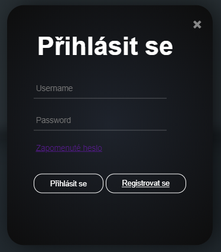

# Uživatelská příručka
Cílem tohoto dokumentu je seznámení uživatelů XB1 fans s funkcionalitami stránky. 
### Uživatelská sekce
- Registrace 
    - Uživatel zadá svoje přihlašovací údaje a následně je na zadaný email zaslán aktivační odkaz.
    
    
    - Expirační doba odkazu je 24 hodin.

    

- Přihlášení
    - Přihlásit se je možné kliknutím na tato místa.

    
    - Uživatel zadá svoje přihlašovací údaje (je nutná úspěšná registrace). Po přihlášení jsou uživateli odemknuty funkcionality pro přihlášené.
    
    
    - Pokud si uživatel potřebuje resetovat heslo, musí kliknout na tento odkaz při přihlášení.
    
    
    - Následně zadá svůj email, na který mu bude poslány instrukce k nastavení nového hesla.
    
    
    - Nastavení hesla
    
    

### Profilová sekce
- V profilové sekci si uživatel může změnit svoje přihlašovací a osobní údaje.

     
- Pro změnu hesla platí stejná pravidla jako při registraci.

    
- Pro změnu emailu se musí ověřit nově zadaná emailová adresa zasláním aktivačního odkazu.  Expirační doba odkazu je 24 hodin.

    
- Změna osobních údajů je dobrovolná, slouží převážně k urychlení objednávek z e-shopu XB1 fans automatickým doplněním osobních údajů. Pro změnu profilového obrázku se doporučují obrázky do rozlišení 300x300 pixelů, větší obrázky jsou zmenšeny do vhodné velikosti.
    
    

### E-shop sekce
- Přidání nového produktu do košíku

     
- Přidání již přidaného produktu do košíku 

     
- Odebrání 1 kusu zboží z košíku 

     
- Odebrání všech kusů konkrétního zboží

     
- Odebrání všech kusů zboží

     
- Upravení stavajícího produktu

     
- Potvrzení zaplacení objednávky

    
- Smazaní objednávky

    
### Článková sekce
- Při vstupu do sekce článků se uživateli zobrazí seznam všech článků

- Správcům se zobrazí navíc nástroje pro správu, přidávání a mazání článků

- Uživatel může filtrovat články dle kategorie

- Články lze vyhledávat - výsledek budou články, jejichž tagy nebo název, obsahuje alespoň jedno zadané klíčové slovo

### Detail článku
- Detail článku začíná vždy názvem daného článku, poté vlevo pod čarou je vždy datum vytvoření. Dále následuje text samotného článku. Na levé straně je vždy uveden autor, nicméně ostatní atributy článku, konkrétněji kategorie (vlevo), tagy a zdroje (vlevo), nemusí být vždy zobrazeny. To záleží na autorovi, zdali je k danému článku přidal, či nikoli. V našem případě jsou přidány všechny možné atributy.
- Tlačítko „Upravit článek“ je viditelné pouze pro uživatele, kteří mají příslušné právo upravovat články. Jedná se o přesměrování na editační stránku daného článku.
    

- Dále je možné přidávat pod článek komentáře, pokud to bylo povoleno. Jednotlivé komentáře lze přidávat pomocí psaní do textového pole a poté kliknutím na tlačítko „Odeslat“. 

    
- Další funkcionalitou této sekce je odpovídaní na jednotlivé komentáře. Pro odpověď na daný komentář je potřeba kliknout na tlačítko „Odpovědět“ pod tímto komentářem, pak zadat text do zobrazeného textového pole a nakonec znovu kliknout na tlačítko „Odpovědět“.    

    

### Fórum sekce
- Fórum umožňuje autorizovanému uživateli zapojovat se do diskuze s ostatními uživateli.
- Zde mohou uživatelé sdílet vlastní tvorbu s dalšími uživateli, a získat zároveň zpětnou vazbu formou komentářů.
#### Hlavní stránka
- Hlavní stránka fóra obsahuje přehled jednotlivých kategoríí fór, u každého je náhled posledního aktivního fóra.
- V horní části je odkaz na přehled všech fór.
- Kliknutím na nadpis kategorie fóra je uživatel přesměrován na stránku co obsahuje přehled všech fór dané kategorie.
- Pokud je přihlášený správce stránky, má navíc možnost kategorii fóra editovat
- Pokud je přihlášený správce stránky, pod přehledem všech kategorií má odkaz pro vytvoření nové kategorie.
- Kliknutím na nadpis jednotlivého fóra, je uživatel přenesen
-   
#### Přehled fór kategorie
- Stránka obsahuje všechna fóra dané kategorie, seřazené sestupně dle poslední aktivity.
- Pokud je kategorie uzavřená, můžou v ní nová fóra vytvářet jen správci.
- Pokud je kategorie otevřená, mohou do ní přispívat novými fóry všichni autorizovaní uživatelé
- Kliknutím na nadpis fóra je uživatel přesměrován na detail fóra, kde se může zapojit do diskuze.
-   
#### Detail fóra
- V horní části fóra (hlavička) je nadpis a text, který zadal uživatel, co fórum vytvořil.
- Pod hlavičkou fóra je sekce komentářů.
- Autorizovaní uživatelé mohou do diskuze psát komentáře a zároveň reagovat na komentáře ostatních.

